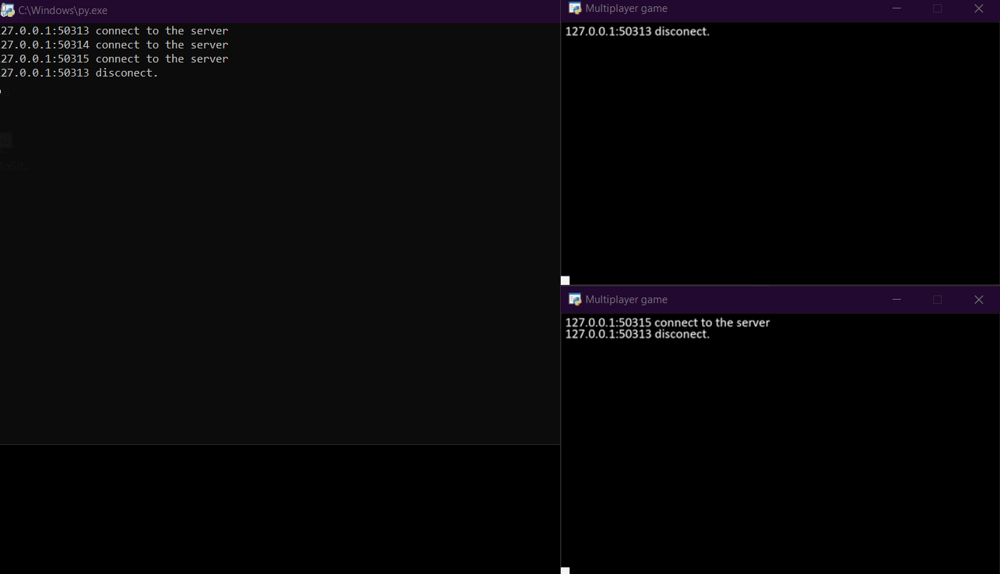
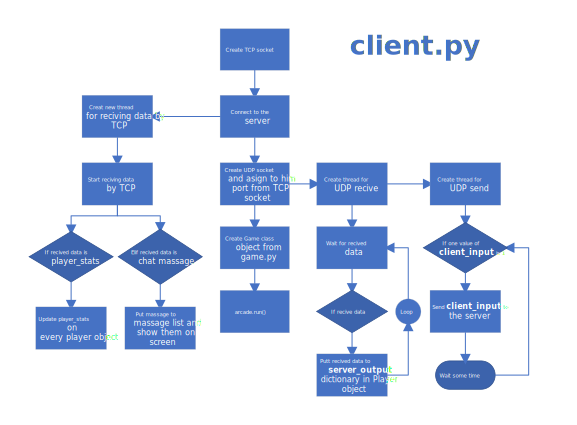

Multiplayer-Arcade is a freamwork designed to make it easier for you to write multiplayer games so that
you don't have to worry about all the difficult issues related to communication between players.
With this framework you can write your own multiplayer game almost as easily as if you were writing
a regular game in the Arcade library.

Everything you need to write your own multiplayer game is in game.py.

To start the server you need to run the server.py file.
(you don't need to know how it works but of course it would be better if you knew how it works)

The client.py file is used to start game and connect to the server, 
if you want run it without console, you can change extension to .pyw

#### What is already working:
- sending client input status from client to server using UDP protocol
- sending server output like the player's position using the UDP protocol
- Creating a new player object after client join on client and server side
- Delete player object after client disconect on client and server side
- Chat using TCP protocol
- Integration with the Arcade library

#### What will be introduced in the next version:
- Sending players stats using TCP protocol
- Displaying players stats after pressing the TAB button
- Player movement acceleration so that the server can send less data
- Integration with PIP

### How the server works

### How the client works
